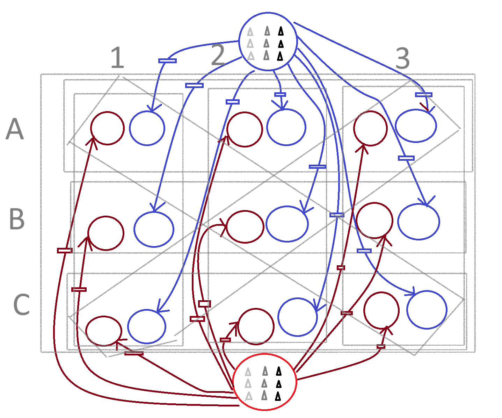

# OtrioSim

A Colored Petri Net (CPN) simulation of **Otrio**, a strategic tic-tac-toe variant board game.

## Game Overview

Otrio is played on a 3x3 grid where players place pieces of three different sizes (small, medium, large). A player wins by achieving one of the following:

1. **Nested Win**: Place all three sizes (small, medium, large) in the same space
2. **Same Size Win**: Place three pieces of the same size in a row, column, or diagonal
3. **Ordered Win**: Place three pieces in ascending or descending size order in a row, column, or diagonal

## CPN Model Design

The game is modeled as a Colored Petri Net with the following structure:



### Model Architecture

```
                    ┌─────────────────┐
                    │  Blue_Initial   │ ← 9 tokens: 3×SMALL, 3×MEDIUM, 3×LARGE
                    │   (△△△ △△△ ▲▲▲) │
                    └────────┬────────┘
                             │
         ┌───────────────────┼───────────────────┐
         │                   │                   │
         ▼                   ▼                   ▼
    ┌─────────┐        ┌─────────┐        ┌─────────┐
    │Blue_to_ │        │Blue_to_ │        │Blue_to_ │  ... (9 transitions)
    │   A1    │        │   A2    │        │   A3    │
    └────┬────┘        └────┬────┘        └────┬────┘
         │                   │                   │
         ▼                   ▼                   ▼
    ┌─────────┐        ┌─────────┐        ┌─────────┐
    │ Blue_A1 │        │ Blue_A2 │        │ Blue_A3 │
    └─────────┘        └─────────┘        └─────────┘

    ┌─────────┐        ┌─────────┐        ┌─────────┐
    │ Blue_B1 │        │ Blue_B2 │        │ Blue_B3 │  (9 board places per player)
    └─────────┘        └─────────┘        └─────────┘

    ┌─────────┐        ┌─────────┐        ┌─────────┐
    │ Blue_C1 │        │ Blue_C2 │        │ Blue_C3 │
    └─────────┘        └─────────┘        └─────────┘

                    ┌─────────────────┐
                    │  Red_Initial    │ ← 9 tokens: 3×SMALL, 3×MEDIUM, 3×LARGE
                    │   (△△△ △△△ ▲▲▲) │
                    └────────┬────────┘
                             │
                            ...  (same structure for Red player)
```

### Components

| Component | Count | Description |
|-----------|-------|-------------|
| **Places** | 20 | 2 initial + 18 board positions (9 per player) |
| **Transitions** | 18 | One per position per player |
| **Arcs** | 36 | Input/output arcs connecting places to transitions |
| **Color Set** | 1 | Size = {SMALL, MEDIUM, LARGE} |

### Token Colors

| Token | Symbol | Description |
|-------|--------|-------------|
| SMALL | △ (light gray) | Smallest piece |
| MEDIUM | △ (dark gray) | Medium piece |
| LARGE | ▲ (black) | Largest piece |

## Installation

```bash
# Clone the repository
git clone https://gitlab.com/wise-corp/techteam/devops/otriosim.git
cd otriosim

# Install dependencies
pip install cpnpy
```

## Usage

### Run the Simulation

```bash
python otrio_cpn.py
```

This will:
1. Build the CPN model
2. Simulate a random game using the CPN
3. Explore the state space (limited to 50,000 states by default)

### Example Output

```
============================================================
OTRIO - Colored Petri Net Simulation
============================================================

1. Building CPN model...
   Places: 20
   Transitions: 18
   Arcs: 36

2. Creating initial marking...
   Blue initial tokens: ['SMALL', 'SMALL', 'SMALL', 'MEDIUM', 'MEDIUM', 'MEDIUM', 'LARGE', 'LARGE', 'LARGE']
   Red initial tokens: ['SMALL', 'SMALL', 'SMALL', 'MEDIUM', 'MEDIUM', 'MEDIUM', 'LARGE', 'LARGE', 'LARGE']

3. Simulating a game using CPN model...
----------------------------------------
Move 1: BLUE places MEDIUM at A2
Move 2: RED places MEDIUM at A1
Move 3: BLUE places LARGE at B2
...
WINNER: RED
```

### Using as a Library

```python
from otrio_cpn import (
    build_otrio_cpn,
    create_initial_marking,
    simulate_cpn_game,
    explore_state_space,
    OtrioGameState
)

# Build the CPN model
cpn, places, transitions = build_otrio_cpn()

# Create initial marking
marking = create_initial_marking(cpn)

# Simulate a game
simulate_cpn_game(cpn, seed=42)

# Explore state space
stats, visited = explore_state_space(max_states=100000)
```

## State Space Analysis

The state space exploration provides insights into the game:

| Metric | Value (sample) |
|--------|----------------|
| Total states explored | 50,000 |
| Terminal states | ~39,000 |
| BLUE wins | ~16,400 |
| RED wins | ~20,000 |
| Minimum depth to win | 5 moves |
| Maximum depth | 18 moves |

## Win Conditions

### 1. Nested Win (all sizes in one space)

```
Position A1: [S M L]  ← SMALL + MEDIUM + LARGE = WIN
```

### 2. Same Size Win (three in a row)

```
  1   2   3
A [S] [S] [S]  ← Three SMALL in row A = WIN
B [ ] [ ] [ ]
C [ ] [ ] [ ]
```

### 3. Ordered Win (ascending/descending)

```
  1   2   3
A [S] [ ] [ ]
B [ ] [M] [ ]  ← SMALL → MEDIUM → LARGE diagonal = WIN
C [ ] [ ] [L]
```

## Project Structure

```
otriosim/
├── README.md           # This file
├── CLAUDE.md           # Project context for Claude Code
├── otrio_cpn.py        # Main CPN implementation
├── .gitlab-ci.yml      # CI/CD configuration
└── docs/
    └── otrio_cpn_diagram.png  # CPN diagram
```

## License

Internal use - WiseCorp TechTeam

## References

- [Otrio Board Game Rules](https://www.spinmaster.com/en-US/brands/marbles-brain-workshop/otrio)
- [cpn-py: Python Colored Petri Net Library](https://github.com/fit-alessandro-berti/cpn-py)
- [Colored Petri Nets (Jensen, 1997)](https://link.springer.com/book/10.1007/978-3-662-03241-1)
